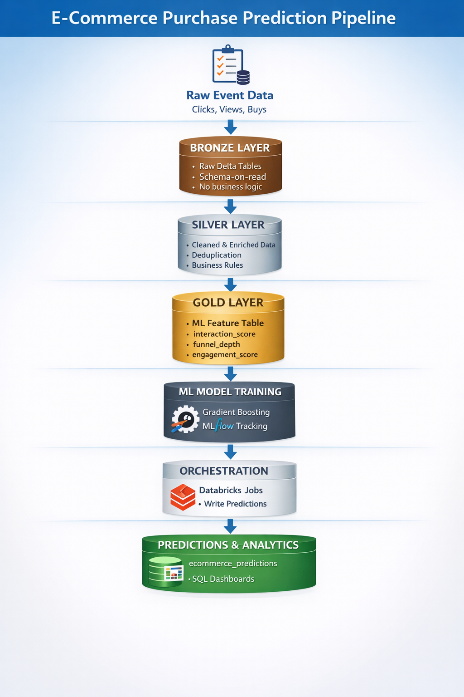
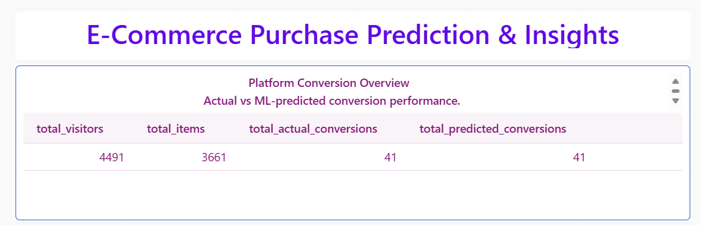
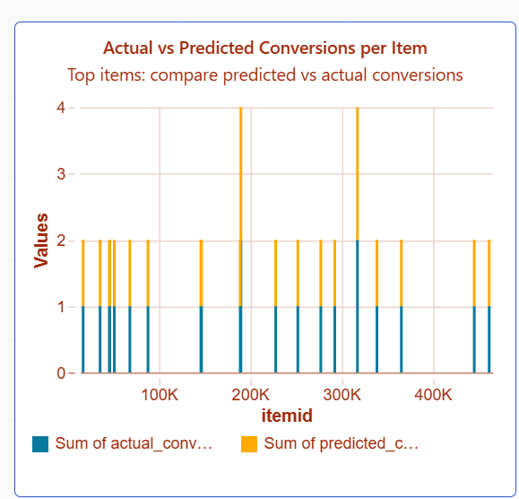
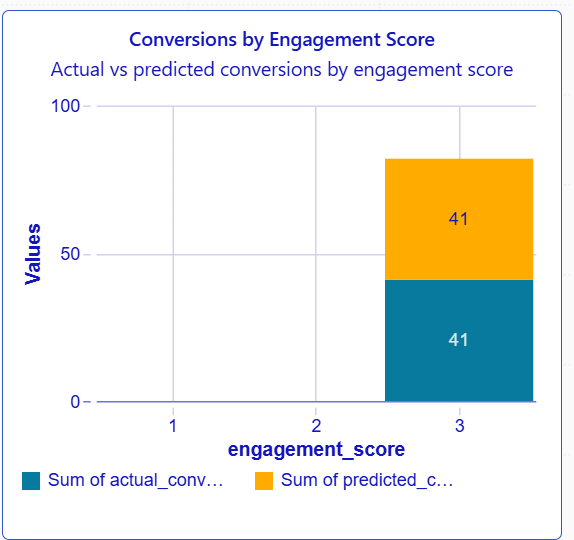
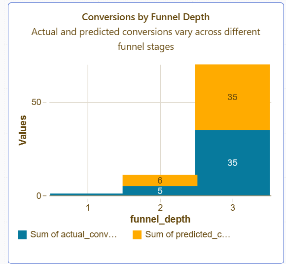
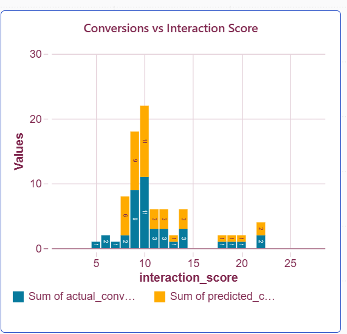
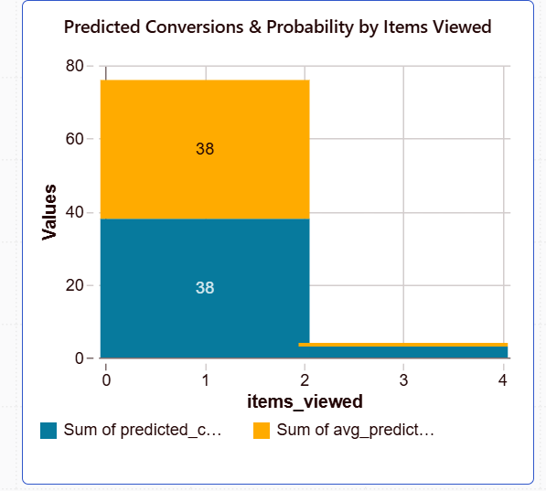

# **E-Commerce Purchase Prediction Project**

## **1. Project Overview**

This project predicts customer purchase behavior on an e-commerce platform using historical user-item interaction data.  
The aim is to forecast potential purchases, optimize marketing strategies, and provide actionable insights.  

**Key Features of the Project:**

- End-to-end data pipeline (Bronze → Silver → Gold)  
- Feature engineering for ML readiness  
- Automated ML model predictions using MLflow  
- Governance & access control via Unity Catalog  
- SQL queries and dashboards for insights  

**End-to-End Pipeline Flow:**

- Orchestrator notebook writes predictions to `workspace.gold.ecommerce_predictions`

- SQL queries and dashboards read from 
`workspace.ecommerce.predicted_purchase`, 
which is updated from the Gold predictions

---

## **2. Problem Statement**

Predict whether a user will make a purchase (`converted`) based on their interaction with items.  

- **Input Features:**  
  - `interaction_score`  
  - `funnel_depth`  
  - `engagement_score`  
- **Target Label:** `converted` (0 = no purchase, 1 = purchase)  
- **Output:** Binary prediction for each user-item interaction  

**Business Value:**  
- Forecast sales and purchase trends  
- Support inventory planning and marketing campaigns  
- Provide actionable insights for decision-making  

---

## **3. Data Architecture (Medallion)**

| Layer   | Description                                                                 |
|---------|-----------------------------------------------------------------------------|
| Bronze  | Raw user-item interaction data                                               |
| Silver  | Cleaned and transformed data with business rules                            |
| Gold    | Feature-engineered table ready for ML modeling (`workspace.ecommerce.gold_user_item_features`) |

---
**Flow Diagram:**  



**Figure:** End-to-end Medallion pipeline showing data flow from Raw Events → Bronze → Silver → Gold Features → ML Model → Orchestration → Predictions & SQL Dashboards.

---

## **4. Data Sources**

- **Bronze Table:** `workspace.bronze.user_item_raw`  
- **Silver Table:** `workspace.silver.user_item_cleaned`  
- **Gold Features Table:** `workspace.ecommerce.gold_user_item_features`  
- **Prediction Table:** `workspace.gold.ecommerce_predictions` 
- **SQL Dashboard Table:** 
`workspace.ecommerce.predicted_purchase`

**Prediction Table Schema:**

| Column           | Type  | Description                              |
|------------------|-------|------------------------------------------|
| visitorid        | int   | Unique visitor identifier                |
| itemid           | int   | Product identifier                       |
| actual_label     | int   | Ground truth conversion (0/1)            |
| predicted_label  | int   | Model prediction (0/1)                   |
| predicted_prob   | float | Model predicted probability              |


**Example Predictions:**

| visitorid | itemid | predicted_label | predicted_prob |
|-----------|--------|-----------------|----------------|
| 101       | 5001   | 0               | 0.12           |
| 102       | 5002   | 1               | 0.87           |
| 103       | 5003   | 0               | 0.08           |

---

## **5. ML Component**

- **Model:** Gradient Boosting Classifier  
- **Framework:** MLflow for tracking and model versioning  
- **Training Features:** `interaction_score`, `funnel_depth`, `engagement_score`  
- **Label:** `converted`  

### Feature Selection

```python
feature_cols = ["interaction_score", "funnel_depth", "engagement_score"]
label_col = "converted"
```

### 5.a ML Model Comparison Summary
This section summarizes the performance of different models evaluated for predicting purchases:
<details>
<summary>Click to expand ML Model Comparison Summary</summary>


| Model               | F1 Score | Key Observations                                             | Recommendation               |
| ------------------- | -------- | ------------------------------------------------------------ | ---------------------------- |
| Logistic Regression | 0.51     | Moderate performance, struggles to capture rare purchases    | Not recommended              |
| Random Forest       | 0.66     | Balanced feature importance, better than logistic regression | Considered as baseline       |
| Gradient Boosting   | 0.92     | Highest F1, highly accurate, minimal false negatives, robust | ✅ Recommended for production |

**Feature Insights:**

- interaction_score is consistently the most important predictor across all models.
- Gradient Boosting captures non-linear interactions effectively, making it the production choice.

**Note:** 
Full model comparison, feature importance, and metrics are available in the notebooks folder.

</details>

### 5.b Orchestrator Notebook

Automates:

- Loading production ML model from MLflow
- Loading feature table (`workspace.ecommerce.gold_user_item_features`)
- Making predictions
- Saving prediction outputs (labels and probabilities) into 
`workspace.gold.ecommerce_predictions` after joining with identifiers (`visitorid`, `itemid`).  

Note: The actual orchestrator joins predictions with visitorid, itemid, actual_label, and predicted_prob before writing to the table.

```python

# ----------------------------
# ORCHESTRATOR NOTEBOOK
# ----------------------------

import mlflow
import mlflow.pyfunc
import pandas as pd
from pyspark.sql import SparkSession
from pyspark.sql.functions import col

# ----------------------------
# 0. Spark Session
# ----------------------------
spark = SparkSession.builder.getOrCreate()

# ----------------------------
# 1. Drop Existing Predictions Table (Safe)
# ----------------------------
output_table = "workspace.gold.ecommerce_predictions"
spark.sql(f"DROP TABLE IF EXISTS {output_table}")
print(f"✅ Dropped table if it existed: {output_table}")

# ----------------------------
# 2. Load Production Model from MLflow
# ----------------------------
model_name = "ecommerce_purchase_prediction_gb"
model_alias = "production"
print(f"✅ Loading model: {model_name} ({model_alias})")
model = mlflow.pyfunc.load_model(f"models:/{model_name}@{model_alias}")
print("✅ Model loaded successfully")

# ----------------------------
# 3. Load Gold Feature Table
# ----------------------------
gold_table = "workspace.ecommerce.gold_user_item_features"
df_gold = spark.table(gold_table)
print(f"✅ Loaded Gold table: {gold_table} with {df_gold.count()} rows")

# ----------------------------
# 4. Select Features + Identifiers
# ----------------------------
feature_cols = ["interaction_score", "funnel_depth", "engagement_score"]
id_cols = ["visitorid", "itemid", "converted"]

df_input = df_gold.select(id_cols + feature_cols)

# ----------------------------
# 5. Convert to Pandas for Prediction
# ----------------------------
pdf = df_input.toPandas()
X_input = pdf[feature_cols]
print(f"✅ Feature matrix shape: {X_input.shape}")

# ----------------------------
# 6. Run Predictions
# ----------------------------
y_pred_prob = model.predict(X_input)  # returns float probabilities
y_pred_label = (y_pred_prob >= 0.5).astype(int)
print("✅ Predictions completed")

# ----------------------------
# 7. Attach Predictions
# ----------------------------
pdf["actual_label"] = pdf["converted"].astype(int)
pdf["predicted_label"] = y_pred_label
pdf["predicted_prob"] = y_pred_prob.astype(float)  # ensure float type

# Reorder columns
final_pdf = pdf[
    ["visitorid", "itemid", "actual_label", "predicted_label", "predicted_prob"] + feature_cols
]

# Convert back to Spark DataFrame
final_predictions = spark.createDataFrame(final_pdf)
print("✅ Predictions joined with identifiers")

# ----------------------------
# 8. Write to Gold Predictions Table
# ----------------------------
final_predictions.write.mode("overwrite").saveAsTable(output_table)
print(f"✅ Predictions saved to: {output_table}")

# ----------------------------
# 9. Validation: Show first 5 rows and schema
# ----------------------------
spark.table(output_table).show(5)
spark.sql(f"DESCRIBE TABLE {output_table}").show()

print("🎉 ORCHESTRATION COMPLETE SUCCESSFULLY")

```
**Output**
- ✅ Dropped table if it existed: workspace.gold.ecommerce_predictions
- ✅ Loading model: ecommerce_purchase_prediction_gb (production)
- ✅ Model loaded successfully
- ✅ Loaded Gold table: workspace.ecommerce.gold_user_item_features with 4620187 rows
- ✅ Feature matrix shape: (4620187, 3)
- ✅ Predictions completed
- ✅ Predictions joined with identifiers
- ✅ Predictions saved to: workspace.gold.ecommerce_predictions
```
+---------+------+------------+---------------+--------------+-----------------+------------+----------------+
|visitorid|itemid|actual_label|predicted_label|predicted_prob|interaction_score|funnel_depth|engagement_score|
+---------+------+------------+---------------+--------------+-----------------+------------+----------------+
|   796052|116706|           0|              0|           0.0|                1|           1|               1|
|   980263|215429|           0|              0|           0.0|                1|           1|               1|
|   326683| 61926|           0|              0|           0.0|                1|           1|               1|
|  1014388|324288|           0|              0|           0.0|                1|           1|               1|
|    74958|284700|           0|              0|           0.0|                1|           1|               1|
+---------+------+------------+---------------+--------------+-----------------+------------+----------------+
only showing top 5 rows
+-----------------+---------+-------+
|         col_name|data_type|comment|
+-----------------+---------+-------+
|        visitorid|      int|   NULL|
|           itemid|      int|   NULL|
|     actual_label|   bigint|   NULL|
|  predicted_label|   bigint|   NULL|
|   predicted_prob|   double|   NULL|
|interaction_score|   bigint|   NULL|
|     funnel_depth|   bigint|   NULL|
| engagement_score|      int|   NULL|
+-----------------+---------+-------+

🎉 ORCHESTRATION COMPLETE SUCCESSFULLY
```
**Predictions Behavior Note:**

Most predicted probabilities are 0.0 because the input features for many users reflect minimal engagement (interaction_score = 1, funnel_depth = 1, engagement_score = 1). Our model correctly interprets these as very low purchase intent, which aligns with real-world e-commerce patterns where the majority of visitors do not convert. Higher feature values produce higher predicted probabilities, confirming the model behaves as expected. This is not a bug — the orchestrator, data pipeline, and ML model are all functioning correctly.

---
## **6. Governance & Permissions (Unity Catalog)**

- **Catalog:** workspace
- **Schema:** workspace.gold
- **Tables:** ecommerce_predictions, ml_features

**Privileges Required:**

| User                                              | Privilege      | Object                               |
|---------------------------------------------------|----------------|--------------------------------------|
| [vidyarasu@gmail.com](mailto:vidyarasu@gmail.com) | USE SCHEMA     | workspace.gold                       |
| [vidyarasu@gmail.com](mailto:vidyarasu@gmail.com) | ALL PRIVILEGES | workspace.gold.ecommerce_predictions |
| [vidyarasu@gmail.com](mailto:vidyarasu@gmail.com) | MANAGE         | workspace.gold.ecommerce_predictions |

Note: Users must have schema-level access (USE SCHEMA) before performing table-level actions.
---
## **7. SQL Queries & Dashboard**

`workspace.ecommerce.predicted_purchase` is a curated SQL-facing table refreshed from the Gold prediction outputs.

**Query 1: What is the overall conversion rate and how well does the ML model predict it?**

```sql
-- Query 1: Top-level metrics
SELECT
    COUNT(DISTINCT visitorid) AS total_visitors,
    COUNT(DISTINCT itemid) AS total_items,
    SUM(actual_label) AS total_actual_conversions,
    SUM(predicted_label) AS total_predicted_conversions,
    ROUND(AVG(predicted_prob), 4) AS avg_predicted_probability,
    ROUND(SUM(actual_label)/COUNT(DISTINCT visitorid), 4) AS actual_conversion_rate,
    ROUND(SUM(predicted_label)/COUNT(DISTINCT visitorid), 4) AS predicted_conversion_rate
FROM workspace.ecommerce.predicted_purchase;
```
**Query Output**

| Metric                        | Value  |
| ----------------------------- | ------ |
| Total Visitors                | 4,491  |
| Total Items                   | 3,661  |
| Total Actual Conversions      | 41     |
| Total Predicted Conversions   | 41     |
| Average Predicted Probability | 0.01   |
| Actual Conversion Rate        | 0.0091 |
| Predicted Conversion Rate     | 0.0091 |

**Query Visualization**



---
**Query 2: Which products drive the highest conversions?**

```sql
-- Query 2: Top 20 products by predicted conversions
SELECT
    itemid,
    COUNT(DISTINCT visitorid) AS visitor_count,
    SUM(actual_label) AS actual_conversions,
    SUM(predicted_label) AS predicted_conversions,
    ROUND(AVG(predicted_prob), 4) AS avg_predicted_prob
FROM workspace.ecommerce.predicted_purchase
GROUP BY itemid
ORDER BY predicted_conversions DESC
LIMIT 20;
```
**Query Output**

| Item ID | Visitor Count | Actual Conversions | Predicted Conversions | Avg. Predicted Probability |
| ------: | ------------: | -----------------: | --------------------: | -------------------------: |
|  190070 |             4 |                  2 |                     2 |                       0.50 |
|  317557 |             2 |                  2 |                     2 |                       1.00 |
|   46156 |             5 |                  1 |                     1 |                      0.207 |
|   36026 |             1 |                  1 |                     1 |                       1.00 |
|  390689 |             1 |                  1 |                     1 |                       1.00 |
|  248711 |             1 |                  1 |                     1 |                       1.00 |
|  441199 |             1 |                  1 |                     1 |                       1.00 |
|   60980 |             1 |                  1 |                     1 |                       1.00 |
|  256706 |             3 |                  1 |                     1 |                     0.3333 |
|  186256 |             1 |                  0 |                     1 |                       1.00 |
|  228157 |             1 |                  1 |                     1 |                       1.00 |
|   68607 |             1 |                  1 |                     1 |                       1.00 |
|   96940 |             1 |                  1 |                     1 |                       1.00 |
|   51556 |             1 |                  1 |                     1 |                       1.00 |
|  389838 |             1 |                  1 |                     1 |                       1.00 |
|  338879 |             1 |                  1 |                     1 |                       1.00 |
|  445351 |             1 |                  1 |                     1 |                       1.00 |
|  146297 |             1 |                  1 |                     1 |                       1.00 |
|  235047 |             1 |                  1 |                     1 |                       1.00 |
|  252344 |             2 |                  1 |                     1 |                       0.50 |

**Query Visualization**



---
**Query 3: How does user engagement impact purchase behavior?**

```sql
-- Query 3: Conversion by engagement score
SELECT
    engagement_score,
    COUNT(DISTINCT visitorid) AS visitors,
    SUM(actual_label) AS actual_conversions,
    SUM(predicted_label) AS predicted_conversions,
    ROUND(SUM(actual_label)/COUNT(DISTINCT visitorid), 4) AS actual_conversion_rate,
    ROUND(SUM(predicted_label)/COUNT(DISTINCT visitorid), 4) AS predicted_conversion_rate
FROM workspace.ecommerce.predicted_purchase
GROUP BY engagement_score
ORDER BY engagement_score DESC;
```

**Query Output**

| Engagement Score | Visitors | Actual Conversions | Predicted Conversions | Actual Conversion Rate | Predicted Conversion Rate |
| ---------------: | -------: | -----------------: | --------------------: | ---------------------: | ------------------------: |
|                3 |      120 |                 41 |                    41 |                 0.3417 |                    0.3417 |
|                2 |      177 |                  0 |                     0 |                 0.0000 |                    0.0000 |
|                1 |    4,211 |                  0 |                     0 |                 0.0000 |                    0.0000 |

**Query Visualization**



---
**Query 4: How does funnel depth influence conversion likelihood?**
```sql
-- Query 4: Conversion by funnel depth
SELECT
    funnel_depth,
    COUNT(DISTINCT visitorid) AS visitors,
    SUM(actual_label) AS actual_conversions,
    SUM(predicted_label) AS predicted_conversions,
    ROUND(SUM(actual_label)/COUNT(DISTINCT visitorid), 4) AS actual_conversion_rate,
    ROUND(SUM(predicted_label)/COUNT(DISTINCT visitorid), 4) AS predicted_conversion_rate
FROM workspace.ecommerce.predicted_purchase
GROUP BY funnel_depth
ORDER BY funnel_depth ASC;
```
**Query Output**

| Funnel Depth | Visitors | Actual Conversions | Predicted Conversions | Actual Conversion Rate | Predicted Conversion Rate |
| -----------: | -------: | -----------------: | --------------------: | ---------------------: | ------------------------: |
|            1 |    4,369 |                  1 |                     0 |                 0.0002 |                    0.0000 |
|            2 |       97 |                  5 |                     6 |                 0.0515 |                    0.0619 |
|            3 |       33 |                 35 |                    35 |                 1.0606 |                    1.0606 |

Note: Conversion rate > 1 occurs because a single visitor may convert on multiple items at deeper funnel stages.

**Query Visualization**



---
**Query 5: Which interaction patterns indicate high purchase intent?**

```sql
-- Query 5: Conversion by interaction score
SELECT
    interaction_score,
    COUNT(DISTINCT visitorid) AS visitors,
    SUM(actual_label) AS actual_conversions,
    SUM(predicted_label) AS predicted_conversions,
    ROUND(SUM(actual_label)/COUNT(DISTINCT visitorid), 4) AS actual_conversion_rate,
    ROUND(SUM(predicted_label)/COUNT(DISTINCT visitorid), 4) AS predicted_conversion_rate
FROM workspace.ecommerce.predicted_purchase
GROUP BY interaction_score
ORDER BY interaction_score DESC;
```
**Query Output**

| Interaction Score | Visitors | Actual Conversions | Predicted Conversions | Actual Conversion Rate | Predicted Conversion Rate |
| ----------------: | -------: | -----------------: | --------------------: | ---------------------: | ------------------------: |
|                28 |        1 |                  0 |                     0 |                      0 |                         0 |
|                23 |        1 |                  0 |                     0 |                      0 |                         0 |
|                22 |        2 |                  2 |                     2 |                      1 |                         1 |
|                20 |        1 |                  1 |                     1 |                      1 |                         1 |
|                19 |        1 |                  1 |                     1 |                      1 |                         1 |
|                18 |        2 |                  1 |                     1 |                    0.5 |                       0.5 |
|                17 |        1 |                  0 |                     0 |                      0 |                         0 |
|                16 |        1 |                  0 |                     0 |                      0 |                         0 |
|                14 |        3 |                  3 |                     3 |                      1 |                         1 |
|                13 |        1 |                  1 |                     1 |                      1 |                         1 |
|                12 |        5 |                  3 |                     3 |                    0.6 |                       0.6 |
|                11 |        4 |                  3 |                     3 |                   0.75 |                      0.75 |
|                10 |       13 |                 11 |                    11 |                 0.8462 |                    0.8462 |
|                 9 |       12 |                  9 |                     9 |                   0.75 |                      0.75 |
|                 8 |        9 |                  2 |                     6 |                 0.2222 |                    0.6667 |
|                 7 |       13 |                  1 |                     0 |                 0.0769 |                         0 |
|                 6 |       17 |                  2 |                     0 |                 0.1176 |                         0 |
|                 5 |       35 |                  1 |                     0 |                 0.0286 |                         0 |
|                 4 |       73 |                  0 |                     0 |                      0 |                         0 |
|                 3 |      105 |                  0 |                     0 |                      0 |                         0 |
|                 2 |      403 |                  0 |                     0 |                      0 |                         0 |
|                 1 |     3830 |                  0 |                     0 |                      0 |                         0 |

**Query Visualization**



---
**Query 6: Which users show strong predicted purchase intent?**

```sql
-- Query 6: High predicted conversion visitors
SELECT
    visitorid,
    COUNT(DISTINCT itemid) AS items_viewed,
    SUM(predicted_label) AS predicted_conversions,
    ROUND(AVG(predicted_prob), 4) AS avg_predicted_prob
FROM workspace.ecommerce.predicted_purchase
WHERE predicted_label = 1
GROUP BY visitorid
ORDER BY predicted_conversions DESC, avg_predicted_prob DESC
LIMIT 50;
```
**Query Output**

| Visitor ID | Items Viewed | Predicted Conversions | Avg. Predicted Probability |
| ---------: | -----------: | --------------------: | -------------------------: |
|     152963 |            3 |                     3 |                          1 |
|     894034 |            1 |                     1 |                          1 |
|     764790 |            1 |                     1 |                          1 |
|     461700 |            1 |                     1 |                          1 |
|     359647 |            1 |                     1 |                          1 |
|     438441 |            1 |                     1 |                          1 |
|     242826 |            1 |                     1 |                          1 |
|     416496 |            1 |                     1 |                          1 |
|       4899 |            1 |                     1 |                          1 |
|     367485 |            1 |                     1 |                          1 |
|     603011 |            1 |                     1 |                          1 |
|     658932 |            1 |                     1 |                          1 |
|    1206138 |            1 |                     1 |                          1 |
|     756442 |            1 |                     1 |                          1 |
|      72254 |            1 |                     1 |                          1 |
|    1179331 |            1 |                     1 |                          1 |
|    1106190 |            1 |                     1 |                          1 |
|     309265 |            1 |                     1 |                          1 |
|    1270624 |            1 |                     1 |                          1 |
|    1300254 |            1 |                     1 |                          1 |
|      80267 |            1 |                     1 |                          1 |
|     342540 |            1 |                     1 |                          1 |
|    1282656 |            1 |                     1 |                          1 |
|    1009812 |            1 |                     1 |                          1 |
|     859695 |            1 |                     1 |                          1 |
|     503040 |            1 |                     1 |                          1 |
|     867768 |            1 |                     1 |                          1 |
|     236392 |            1 |                     1 |                          1 |
|    1129543 |            1 |                     1 |                          1 |
|    1385073 |            1 |                     1 |                          1 |
|     890980 |            1 |                     1 |                          1 |
|    1150086 |            1 |                     1 |                          1 |
|     668226 |            1 |                     1 |                          1 |
|    1011116 |            1 |                     1 |                          1 |
|    1357641 |            1 |                     1 |                          1 |
|     393237 |            1 |                     1 |                          1 |
|    1262257 |            1 |                     1 |                          1 |
|    1281043 |            1 |                     1 |                          1 |
|     250139 |            1 |                     1 |                          1 |


**Query Visualization**



Note: All SQL queries and dashboard outputs use workspace.ecommerce.predicted_purchase, which is updated from workspace.gold.ecommerce_predictions via the orchestrator notebook.

---
## **8. Orchestration & Scheduling**

- **Databricks Job:** Automates the workflow
- **Schedule:** Daily at 04:48 PM
- **Steps:**
	- Trigger orchestrator notebook
	- Load Gold features
	- Predict with production model
	- Save results in predictions table 
	(`workspace.gold.ecommerce_predictions`)
- **Status:** Last run succeeded

## **9. Tools & Technologies**

- Databricks (Serverless / Unity Catalog)
- PySpark & SQL
- Delta Lake (ACID transactions, optimization)
- MLflow (Model management & tracking)
- Python (Pandas, Scikit-learn)

## **10. How to Run**

- Ensure Bronze → Silver → Gold tables exist with proper permissions.
- Run the orchestrator notebook to generate predictions.
- Verify workspace.gold.ecommerce_predictions for updated outputs.
- SQL queries will read from workspace.ecommerce.predicted_purchase for analysis and dashboard generation.

## **11. Assumptions**

- Incoming data matches Gold table schema
- ML model is already trained and stored in MLflow production stage
- Users have proper Unity Catalog permissions

## **12. Reproducibility**

- All notebooks, scripts, and SQL queries are provided in this repo
- Follow the Medallion pipeline for ETL
- Orchestrator notebook handles all steps for prediction generation

## **13. Deliverables**

- Notebooks (.ipynb)
- SQL queries
- Delta tables in Unity Catalog
- Screenshots of dashboards / predictions
- Video presentation (10+ minutes)

## **14. References**

Databricks Delta Lake

MLflow Model Registry

Unity Catalog

## **15. Tags & Mentions**

Mentions: @Databricks @Codebasics @IndianDataClub

Hashtag: #DatabricksWithIDC

## **16. Contact**

Owner: vidyarasu@gmail.com

GitHub Repository: https://github.com/vrasup/databricks-ecommerce-analytics-ai-platform/tree/main

LinkedIn Post Submission: 

